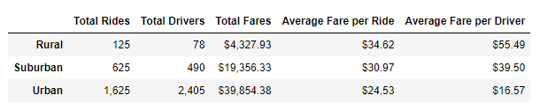
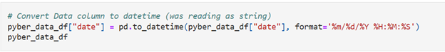
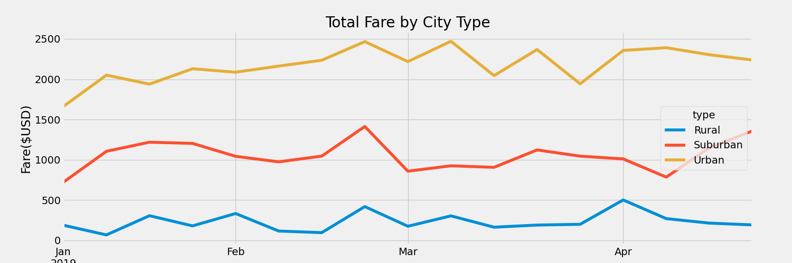

# PyBer Analysis

## Project Overview

This project consisted of performing exploratory analysis of ride-sharing data for PyBer, a ride-sharing app company. The analysis provides data visualizations based on the relationshipp between Rural, Urban, and Suburban city types and fare costs that will help facilitate decision making. We merged two large data files containing information about individual rides, cities (by type: Urban, Rural, Suburban), drivers and fares, and we calculated the following:

  - The total number of rides for each city type
  - The total number of drivers for each city type
  - The sum of the fares for each city type
  - The average fare per ride for each city type
  - The average fare per driver for each city type

Using Pandas skills and the functions, pivot() and resample(), we then created a multiple-line graph that shows the total fares for each week by city type from January 1, 2019 to April 28, 2019.

## PyBer Analysis Results 
### Deliverable 1:
- From the merged data set, we started by grouping the data by types of cities: Rural, Suburban and Urban. We then summed the total fares for each city type and averaged the fares per ride, and driver. The resulting data was used to create the following PyBer Summary data frame.

- The data reflects on the ride-sharing trends and shows us that the further you get from city centers (moving away from Urban cities towards Suburban and Rural cities) the less accessible ride-sharing services become. It is evident through the data results that rural cities had the least number of rides with a total of **125** as compared to Suburban with a **625** and Urban with **1625**. The data also reflects that the costs of ride-sharing rises as the distance from the city center increases, which also impacts the number of Total Drivers per city type. Accesibilty was only **78** drivers that were available in Rural areas compared to Suburban cities with a total of **490** drivers and Urban areas with a total of **2405** drivers. Although Rural cities see the least amount of drivers,rides & fares, they have the highest averages of fare per ride (**$34.62**) and fare per driver (**55.49**), while the Urban cities command the most drivers, rides and fares, they have the lowest averages of fare per ride (**24.53**) and fare per driver (**$16.57**).

### Deliverable 2:
From the original data frame, 
  - We used groupby() to create a new Data Frame showing the sum of the fares for each date where the indices are the city type and date.  However, we had to add an additional step to ensure that the 'date' column was read as datetime rather than as a string to get the appropriate results. You can see the code below:

  - We then reset the index for that table and created a pivot table with the 'date' as the index, the columns ='type', and values='fare' to get the total fares for each type of city by the date. 
  - Using the pivot table, we created a new Data Frame using loc on the given dates, '2019-01-01':'2019-04-29'. 
  - We next set the "date" index to datetime datatype so we could create a new Data Frame using the "resample()" function by week 'W' and get the sum of the fares for each week.
- The results of data are much easily understood with the multi-line graph below as it shows the relationship between the total fares for each week by city type. 
	

As shown in the multiple line graph above, the urban cities had the highest total fare within the months of January to April 2019 followed by the Suburban cities, while the Rural cities had the lowest fare. We can oberve the following from the above line graph, which indicate some disparities among the city types:
* There is an increase in fare for all city types in the fourth week in February. 
* We do not see a consistent increase in fare over time for any of the city types.
* The difference in fare between Urban and Suburban is greater than the difference between Suburban and Rural.
* There does not appear to be a strong relationship between any of the city types, they appear to increase and decrease independently. 

## Summary 

From our data we are able to tell what kind of fares will be commanded based on what city type the passenger is catching a ride in. Although we didn't explore every individual city in our analysis, we still have a great grasp on what fares will look like from week to week based on city type, which is enough information to help us decide on rates that will need to be charged after we can classify what type of city the consumer lives in. However, below are a few suggestions to help address some the disparities we see among city types

### Recommendations
1. Further analysis on the difference between Average Fare per Driver between Suburban and Urban cities to determine if Urban drivers are being paid adequately.

2. Further analysis in rider habits to see why there was an increase in fare at the end of February. What advertising campaign ran at this time? If so, can we recreate them? Are these new riders or did more current riders choose to ride share during this time?

3. Targeted Add campaigns to increase the number of Suburban riders to narrow the gap between Suburban and Urban Riders.

Addressing some of these recommendations will not only address rider, driver, and fare disparities, but will also help the company's overall profit.

## Resources

**Data Source:** city_data.csv, ride_data.csv, pyber_data_df.csv (merged data set)

**Software:** Jupyter Notebook
